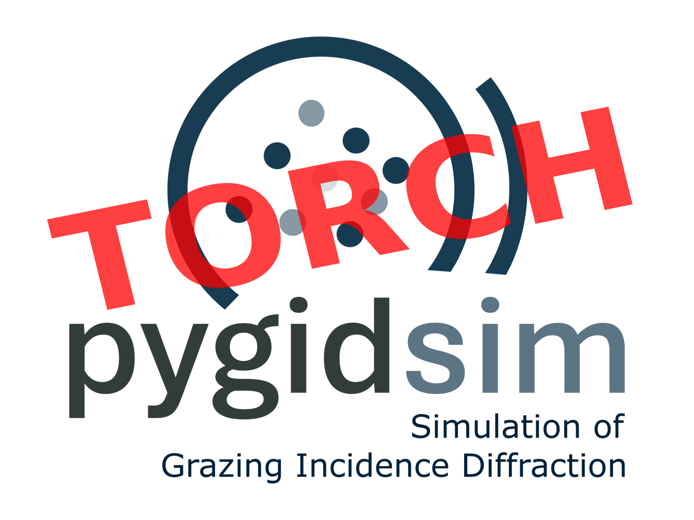

# pygidSIM_torch

_pygidSIM_torch_ calculates GIWAXS patterns from crystal structure descriptions. It is a
PyTorch-based implementation of the pygidSIM package.

[//]: # (<p align="center">)

[//]: # (  )

[//]: # (</p>)

<p align="center">
  
</p>

## Installation

### Install from PyPI

```bash
pip install pygidsim_torch
```

### Install from source

First, clone the repository:

```bash
git clone https://github.com/MishaRomodin/pygidSIM_torch.git
```

Then, to install all required modules, navigate to the cloned directory and execute:

```bash
cd pygidSIM_torch
pip install -e .
```

### Development Installation

For development and testing, install with development dependencies:

```bash
pip install -e .[dev]
```

## Testing

The project uses pytest for testing. To run the test suite:

```bash
# Run all tests
pytest

# Run tests with coverage report
pytest --cov=pygidsim_torch --cov-report=html

# Run tests in parallel
pytest -n auto
```

## Usage

### From CIF

Not implemented yet.

### Crystal description

To calculate a GIWAXS pattern from your own description, use the following example:

```python
import torch
from pygidsim_torch.experiment import ExpParameters
from pygidsim_torch.giwaxs_sim import GIWAXS, Crystal
from pygidsim_torch.directions import get_mi

params = ExpParameters(
    q_xy_range=torch.tensor([0, 2.7]),
    q_z_range=torch.tensor([0, 3.5]),
    en=18000
)  # experimental parameters

# lattice parameters [a, b, c, α, β, γ]
lat_par = torch.tensor([6.3026, 6.3026, 6.3026, 90., 90., 90.], dtype=torch.float32)
mi = get_mi(min_index=-6, max_index=6)  # Miller indices

cr = Crystal(lat_par)
el = GIWAXS(cr, params)
q_2d, q_mask = el.giwaxs_sim()
```

To add crystal rotation, use the argument `orientation` with the value `"random"` or a Tensor containing the
corresponding
Miller indices [hkl]:

```python
q_2d, q_mask = el.giwaxs_sim(orientation='random')

q_2d, q_mask = el.giwaxs_sim(orientation=torch.tensor([2., 0., 1.]))
```

For multiple structures, the lattice parameters tensor should have shape (n_structures, 6).

The orientation tensor should have shape (n_structures, 3) or (3,) in case of same orientations for all samples.

## Citation

If you use this package in your research, please cite it as follows:

Romodin, M., Starostin, V., Lapkin, D., Hinderhofer, A., & Schreiber, F. (2025).  
mlgid-project/pygidSIM: v0.1.1. Zenodo. https://doi.org/10.5281/zenodo.17609569
